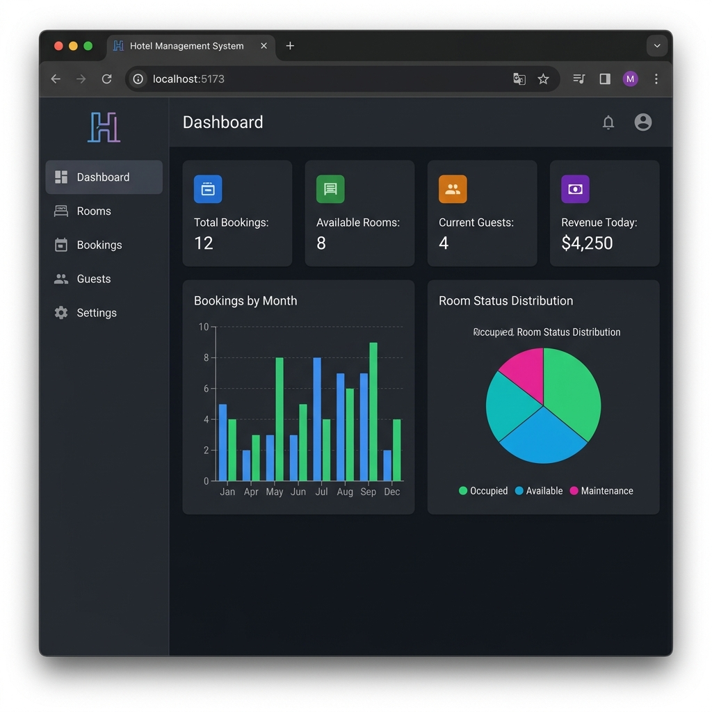
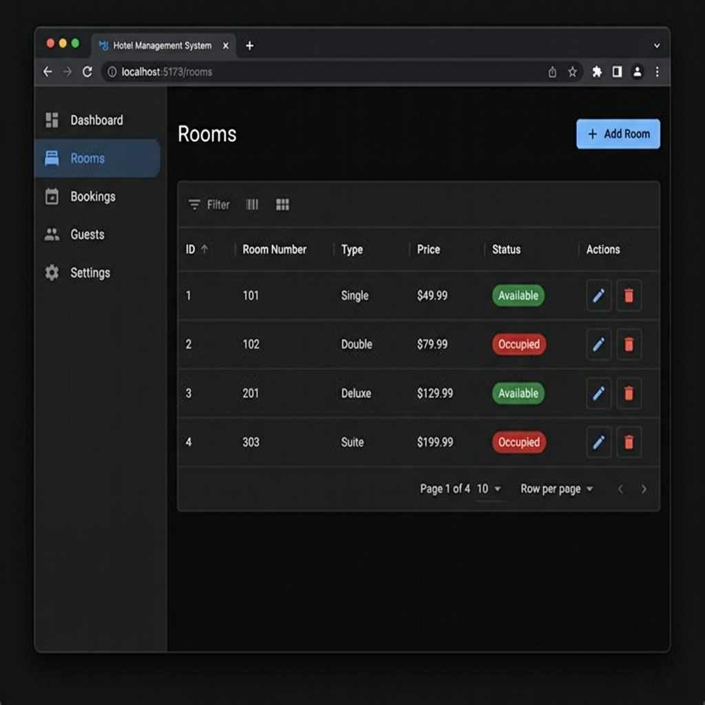
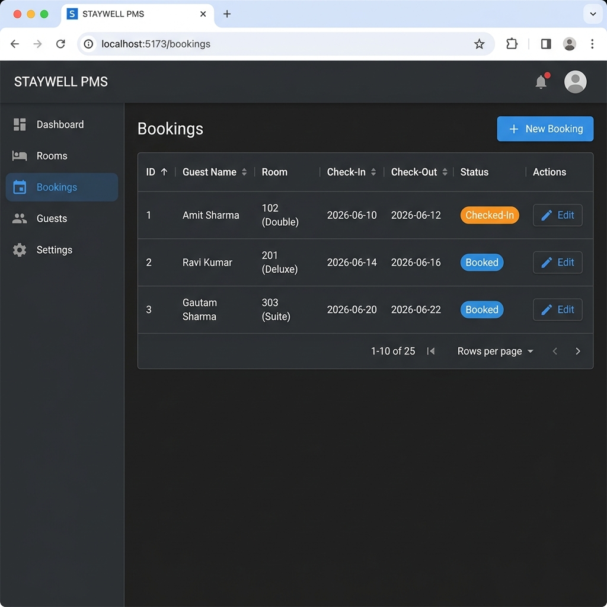
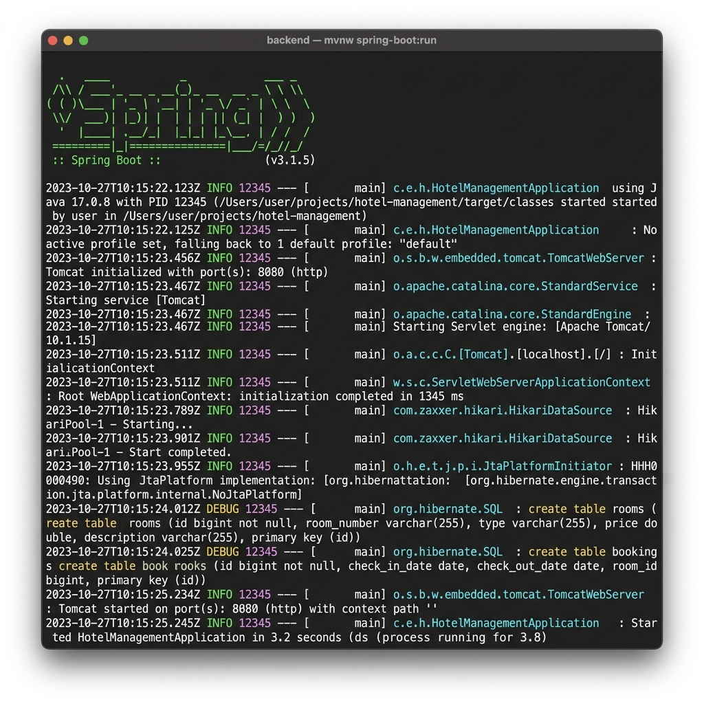
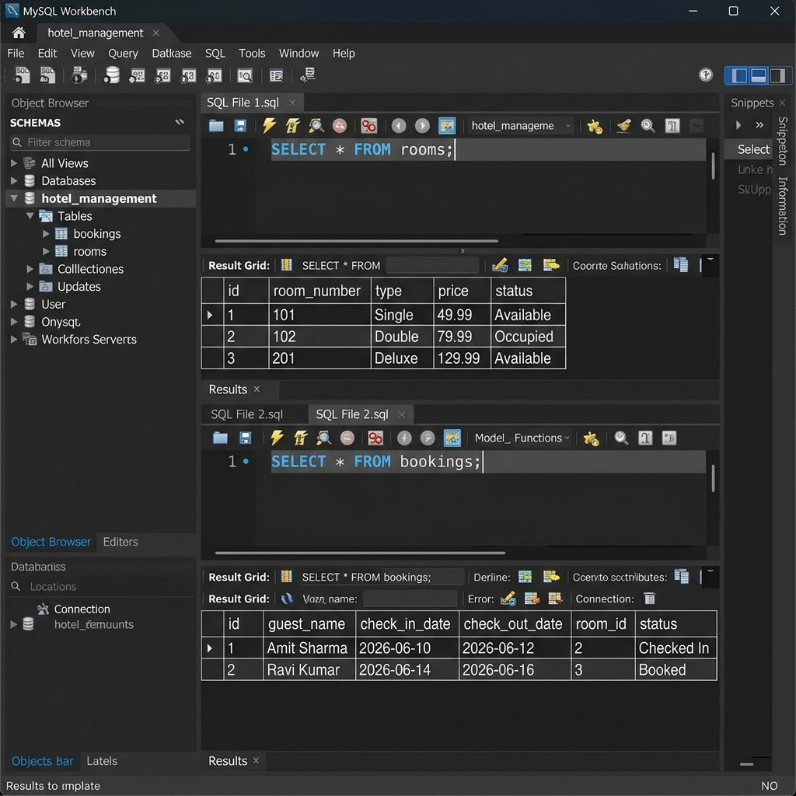

# 🏨 Hotel Management System

A full-stack hotel management application built with **Spring Boot** and **React (Vite)** for managing rooms, bookings, and guest operations.

---

## 📋 Table of Contents

- [Tech Stack](#-tech-stack)
- [Project Structure](#-project-structure)
- [Prerequisites](#-prerequisites)
- [Setup & Installation](#-setup--installation)
- [Running the Application](#-running-the-application)
- [API Endpoints](#-api-endpoints)
- [Database Schema](#-database-schema)
- [Screenshots](#-screenshots)

---

## 🛠 Tech Stack

| Layer      | Technology                          |
|------------|-------------------------------------|
| **Frontend** | React 18, TypeScript, Vite, MUI (Material UI), Recharts |
| **Backend**  | Spring Boot 3.3.5, Spring Data JPA, Lombok |
| **Database** | MySQL 8.0                          |
| **Build**    | Maven (backend), npm (frontend)    |

---

## 📁 Project Structure

```
hotel-management-system/
├── backend/                        # Spring Boot API
│   ├── src/main/java/com/hotel/management/
│   │   ├── controller/
│   │   │   ├── RoomController.java       # Room CRUD endpoints
│   │   │   ├── BookingController.java    # Booking CRUD endpoints
│   │   │   └── DashboardController.java  # Dashboard stats endpoint
│   │   ├── entity/
│   │   │   ├── Room.java                 # Room entity
│   │   │   └── Booking.java             # Booking entity
│   │   ├── repository/
│   │   │   ├── RoomRepository.java
│   │   │   └── BookingRepository.java
│   │   ├── config/
│   │   │   └── CorsConfig.java          # CORS configuration
│   │   └── HotelManagementApplication.java
│   ├── src/main/resources/
│   │   └── application.properties       # DB & server config
│   └── pom.xml
├── frontend/                       # React Vite App
│   ├── src/
│   │   ├── pages/
│   │   │   ├── Dashboard.tsx            # Dashboard with stats & charts
│   │   │   ├── Rooms.tsx                # Room management (CRUD)
│   │   │   └── Bookings.tsx             # Booking management
│   │   ├── layouts/
│   │   │   └── DashboardLayout.tsx      # Sidebar navigation layout
│   │   ├── theme/
│   │   │   └── index.ts                 # MUI dark theme config
│   │   ├── App.tsx                      # Routes & app entry
│   │   └── main.tsx
│   ├── package.json
│   └── vite.config.ts
├── setup.sql                       # Database schema + sample data
├── docker-compose.yml              # MySQL Docker setup (optional)
├── screenshots/                    # Application screenshots
│   ├── dashboard.png
│   ├── rooms.png
│   ├── bookings.png
│   ├── backend-terminal.png
│   └── mysql-workbench.png
└── README.md
```

---

## ✅ Prerequisites

- **Java 17+** — `java -version`
- **Node.js 18+** — `node -v`
- **MySQL 8.0** — installed locally or via Docker
- **Maven** (included via `mvnw` wrapper)

---

## 🚀 Setup & Installation

### 1. Clone the Repository

```bash
git clone <repository-url>
cd hotel-management-system
```

### 2. Set Up MySQL Database

**Option A — Local MySQL:**

```bash
mysql -u root < setup.sql
```

**Option B — Docker (requires Docker installed):**

```bash
docker-compose up -d
mysql -u root -proot -h 127.0.0.1 < setup.sql
```

> **Note:** If using Docker, update `spring.datasource.password=root` in  
> `backend/src/main/resources/application.properties`

### 3. Install Frontend Dependencies

```bash
cd frontend
npm install
```

---

## ▶️ Running the Application

### Start Backend (Port 8080)

```bash
cd backend
./mvnw spring-boot:run
```

### Start Frontend (Port 5173)

```bash
cd frontend
npm run dev
```

Open your browser at **http://localhost:5173** 🎉

---

## 📡 API Endpoints

### Rooms — `/api/rooms`

| Method   | Endpoint          | Description          |
|----------|-------------------|----------------------|
| `GET`    | `/api/rooms`      | Get all rooms        |
| `POST`   | `/api/rooms`      | Create a new room    |
| `PUT`    | `/api/rooms/{id}` | Update a room        |
| `DELETE` | `/api/rooms/{id}` | Delete a room        |

### Bookings — `/api/bookings`

| Method   | Endpoint              | Description                |
|----------|-----------------------|----------------------------|
| `GET`    | `/api/bookings`       | Get all bookings           |
| `POST`   | `/api/bookings`       | Create a new booking       |
| `PUT`    | `/api/bookings/{id}`  | Update booking status      |

### Dashboard — `/api/dashboard`

| Method   | Endpoint                       | Description                  |
|----------|--------------------------------|------------------------------|
| `GET`    | `/api/dashboard/stats`         | Get dashboard statistics     |
| `GET`    | `/api/dashboard/recent-bookings` | Get recent bookings        |

---

## 🗄 Database Schema

### `rooms` Table

| Column        | Type           | Constraints       |
|---------------|----------------|--------------------|
| `id`          | BIGINT         | PRIMARY KEY, AUTO_INCREMENT |
| `room_number` | VARCHAR(50)    | NOT NULL, UNIQUE   |
| `type`        | VARCHAR(100)   | Single / Double / Deluxe / Suite |
| `price`       | DOUBLE         |                    |
| `status`      | VARCHAR(50)    | Available / Occupied |

### `bookings` Table

| Column           | Type           | Constraints       |
|------------------|----------------|--------------------|
| `id`             | BIGINT         | PRIMARY KEY, AUTO_INCREMENT |
| `guest_name`     | VARCHAR(255)   |                    |
| `check_in_date`  | DATE           |                    |
| `check_out_date` | DATE           |                    |
| `room_id`        | BIGINT         | FK → `rooms(id)`, ON DELETE SET NULL |
| `status`         | VARCHAR(50)    | Booked / Confirmed / Checked-In / Checked-Out / Cancelled |

---

## 🖥 Features

- **Dashboard** — Overview with total bookings, available rooms, current guests, and revenue stats
- **Room Management** — Add, edit, and delete rooms with real-time status tracking
- **Booking Management** — Create and manage guest bookings with automatic room status updates
- **Dark Theme UI** — Modern Material UI dark theme with responsive sidebar navigation
- **Data Grid** — Sortable, paginated tables powered by MUI X Data Grid
- **Charts** — Visual analytics using Recharts

---

## 📸 Screenshots

### Dashboard
> Overview with stats cards, booking trends chart, and room status distribution.



### Room Management
> Add, edit, and delete rooms with real-time status tracking via MUI Data Grid.



### Booking Management
> Create and manage guest bookings with status chips and pagination.



### Backend — Spring Boot
> Spring Boot application startup showing Tomcat, Hibernate, and HikariCP initialization.



### MySQL Workbench
> Database schema with `rooms` and `bookings` tables and sample query results.



---

## 📌 Sample SQL Queries (MySQL Workbench)

```sql
USE hotel_management;

-- View all rooms
SELECT * FROM rooms;

-- View all bookings with room details
SELECT b.id, b.guest_name, b.check_in_date, b.check_out_date,
       r.room_number, r.type, b.status
FROM bookings b
LEFT JOIN rooms r ON b.room_id = r.id;

-- Add a new room
INSERT INTO rooms (room_number, type, price, status)
VALUES ('401', 'Suite', 249.99, 'Available');

-- Create a booking
INSERT INTO bookings (guest_name, check_in_date, check_out_date, room_id, status)
VALUES ('John Doe', '2026-07-01', '2026-07-03', 1, 'Booked');
```

---

## 👤 Author

**Gautam Sharma**

---
